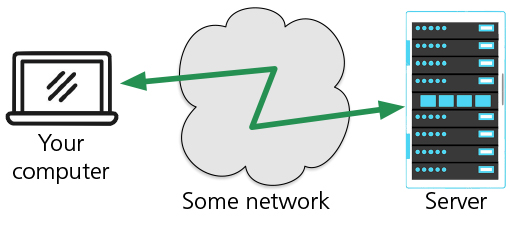
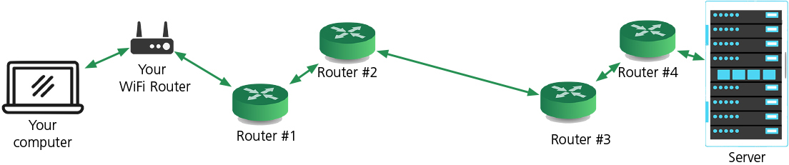
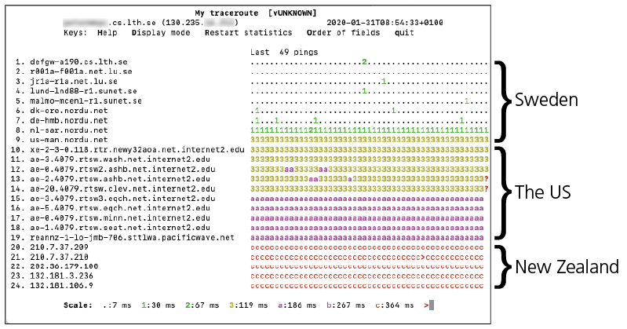
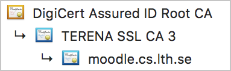

# EXPLANATIONS

Hi!

This text aims at trying to explain a few things that might not be known to all interested users of ``host-info``. Technical knowledge is not required, just curiosity!

I will go through the following:  
* Where computers are (“Geo Location”)
* How far away are they (“Ping times”)
* How things get from one point to another (“The way of the data”)
* Does it really matter? (“Time is money”)
* Are we there yet? (“CDN – Content Delivery Network”)
* Are you sure? (“Certificates”)
* Who knows about my credit card? (“TLS – why we can do banking on the internet”)

It is by no means an exhaustive explanation but merely an “appetiser” of sorts, aiming to direct interest rather than deep explanation.

Oh: there will be pictures! 🤪

---

## Geo Location
This is an increasingly interesting topic. Serious financial interest is invested in knowing where potential customers are located; the Ad industry want nothing more than to know *exactly* where *you* are. And those guys are closely followed (?) by various national security organisations with the same goal: to know where *you* are.
There are a number of web sites that can geographically locate, “geolocate”, an IP address. Both Apples macOS and Microsoft Windows have code that programmers can use for that very purpose.

So can one trust the geolocation information? Well: you get what you pay for. Since I don't pay in this script, the information is only so correct. I have rarely seen a country that wasn't correct, but it happens. The city and region has a lower level of correctness. But from most legal aspects (GDPR for instance) country is good enough. If correct geolocation is important to you, please check with other sources as well!

One simple/primitive way one can check the correcftness of the geolocation is by looking at the ping times.

## Ping times
[Ping](https://en.wikipedia.org/wiki/Ping_(networking_utility)) is a computer network utility used to test the reachability of hosts on Internet (the name ``ping`` comes from submarine warfare). It measures the round-trip time from the originating host to a destination computer and back to the source using a protocol called [ICMP](https://en.wikipedia.org/wiki/Internet_Control_Message_Protocol) (which is not the same as “normal” internet traffic). Not all hosts answers to this kind of traffic, though, so a non-answer might be perfectly “ok”.

*(If you are interested and somewhat technically inclined, I highly recommend the software [mtr](https://github.com/traviscross/mtr)! Pro tip: press ``d`` twice when you run it! More of ``mtr`` later)*

A *very* rough division in times is:

| Ping time | Distance |
|-----------|----------|
|   ≈ 1 ms  | Local network or really close (walking or bicycling distance)  |
|  < 10 ms  | Pretty close, i.e. same country |
| < 100 ms  | Same continent                  |
| > 300 ms  | Other side of the planet        |

The ping time is made up by time spent in various cables (or WiFi) and time spent in routers.

**Time spent in cables**  
The speed of the data signal is roughly:
* in the air (WiFi): about the speed of light (called ``c``): 300,000 km/s
* in an copper wire (ethernet): approx. 64% of ``c``, ≈ 192,000 km/s
* in an optical cable: approx. 70% of ``c``, ≈ 210,000 km/s

So 10 ms will get you:
* 3,000 km in the air
* 1,920 km in copper
* 2,100 through optical fiber

*When doing the calculation, please remember to divide the ping time by 2 since ping measures the **round trip** time!*

**Time spent in routers**  
This is very hard to specify since it varies greatly depending on both the capacity of the routers and their load. Modern “core routers” have an enormous capacity, but are also quite expensive so they are not changed very often. The actual work the routers perform differs: some just pass the packets between then while others also perform various forms of [traffic shaping](https://en.wikipedia.org/wiki/Traffic_shaping) in order to guarantee that “real time media” (voice and video) get priority over data that are not as urgent.

## The way of the data
When two computers communicate, the traffic is chopped up in chunks called “packets”, each holding about half the text of a fully written A4 page (or US letter). These are “routed” over the Internet through boxes called, yes, “routers”.

Very simply put, one might view it as this:  

When one looks more closely, there are more steps inbetween:  
  
As you can see, there are more steps involved. Several routers pass the packets between them and these routers can be located on different continents.

An authentic example is this ``mtr``-session between my computer in Lund, Sweden and the web server at [The University of Canterbury](https://www.canterbury.ac.nz) in New Zealand (on the opposite side of the planet):  
  
Here you can see that 24 routers are involved and the ping times accumulate in “chunks”:  
* while in Sweden, the ping times are below 67 ms and the packets pass 8 routers
* then it enters the US (on the east coast—I checked😉) and exits on the west coast near Seattle (again, I checked) and the ping times increase from 100 to 200 ms while crossing 11 routers on it's way through the North American continent. The 67 ms jump between #14 and #15 above is probably the continental US crossing  
* then it arrives in New Zealand and we are at around 350 ms and we still have 5 routers to go before we have arrived at the University of Canterbury

Those who are interested can view the wonderful [Submarine Cable Map](https://www.submarinecablemap.com) to see where the cables under the oceans are actually located!

## Time is money
Well, this wasn't terribly good! Playing a real time game like Counterstrike with a ping time of 300 ms is absolutely horrible. Or trying to get to a web page that is far away can be a non starter; almost all web pages these days load hundreds of resources from other sites: ads, images, analytics and so on and each of these must be loaded before the web page is fully loaded.

In 2009, Amazon found that every 100 ms of latency cost them 1% in sales. Google found that an extra 0.5 seconds in their page generation dropped traffic by 20%. A broker could lose $4 million in revenues per millisecond if their electronic trading platform was 5 milliseconds behind the competition. That was 2009. In 2017, [Akamai](https://www.akamai.com/uk/en/about/news/press/2017-press/akamai-releases-spring-2017-state-of-online-retail-performance-report.jsp) found that the figure for Amazon sales drop is not 1% but 7%.  
*(Read more here: https://www.gigaspaces.com/blog/amazon-found-every-100ms-of-latency-cost-them-1-in-sales/)*

So, what to do about that?

## CDN – Content Delivery Network:
A content delivery network (CDN) is a service that securely delivers data, videos and applications to customers globally with low latency and high transfer speeds.
Some CDNs also offer DDoS (“attack”) mitigation, that is: they can “absorb” a network attack and make their customers web servers accessible even when under attack.

The CDN operators have datacenters called “Point Of Presence” (POP) spread around the world in order to serve web pages and content quickly to customers. They collaborate with DNS servers to fool them in a clever way: you might have thought that a DNS-name, such as ``www.macworld.com``, **always** resolve to the same IP-address, but it doesn't.
So, while you *think* that you access a web site in another country, or another continent, in reality you are talking to a CDN that may be located in your own country or even region. So when I sit in Sweden and read [MacWorld](https://www.macworld.com), a Mac related news-magazine that is located in San Fransisco in California, USA, I am *really* accessing a CDN-POP in Stockholm (Sweden) operated by the CDN “Fastly”. Pretty neat, but can also make it hard to judge where things really are… Another example is Yale University: it *is* located just north of New York city on the American east coast, but when I access the web page from Sweden, it appears to be located in Dublin, Ireland. If you are living in Indonesia, the DNS you are accessing *for that same web site* will most probably be something else, closer to you. (Yale University uses, i.e. pays, Microsofts web platform to do this).

You can read more about CDN here: https://en.wikipedia.org/wiki/Content_delivery_network

## Certificates – the foundation of internet security
Before we get into how it actually works, we must explain *certificates*.  
  
Like certificates in the real world, digital certificates are used to officially state that something is true. They are used to secure web sites, email and software (to combat malware).

Digital certificates are based on mathematics. They have a certain validity period and they can be [*revoked*](https://en.wikipedia.org/wiki/Certificate_revocation_list), i.e. stop being valid (trusted) on a command from a central authority. They exist in *chains* such as this one for one of our servers at my department:  
  
The certificate for the server is linked via an *intermediate certificate* to a [*root certificate*](https://en.wikipedia.org/wiki/Root_certificate) that has been issued by a [Certificate Authority](https://en.wikipedia.org/wiki/Certificate_authority), in this case DigiCert, a commercial corporation. (Certificates are part of something called [public key infrastructure, PKI](https://en.wikipedia.org/wiki/Public_key_infrastructure), with the purpose of *binding* public keys with people and organizations). This chain is how certificates can be easily checked, and also revoked.

When one create a request for a certificate, a pair of keys is created: a *public key* and a *private key*. The public key is shared (and has to be shared) with anyone. The private key is *not*: the privacy and integrity of the private key plays an absolutely fundamental role in the security system. It is in fact *the* crucial point of the certificate and it is of paramount importance that this key never gets exposed!! It will reside in a hidden directory on the web server, to be read only by the server software when performing encryption.

In order to make all this work smoothly, all modern operating systems (macOS, Windows, iOS, Android etc.) as well as web browsers, come with some form of *certificate storage* mechanism that are pre-loaded with a list of trusted CAs (numbering in the hundreds). These pre-installed certificates serve as trust anchors to derive all further trust from and the operating system or web browser update them regularly. When you are visiting an **https** website, your browser verifies that the trust chain presented ends at one of the *locally* trusted root certificates. Thus there is no need to go online to check it in every case.

Globally trusted root certificates are created and maintained by a small number of multinational companies. Due to the technical requirements, the bar to enter this market is quite high. They operate with a very strict set of agreed upon requirements in order to achieve its goal: *trust*.  
*(Note: certificate authorities both can be, and have been removed from the list of trusted root servers!)*

If you are interested in analyzing certificate, you can go here: https://globalsign.ssllabs.com/analyze.html

## TLS – why we can do banking on the internet
All traffic on the internet start “in the clear” which means that anyone listening to the traffic on it's way from you computer to the destination, can hear everything. If that was all, no-one would do any banking: sending you credit card in the clear over an insecure line is today almost the same as giving it to the bad guys.

So how does the Internet deal with this? How do you manage to go from a situation where A and B are talking to one another, in the clear, while C is listening in to everything they are saying, to a situation where only A and B can understand what they are saying? How do they start their “secret talk” with C listening, but without C being able to get in on the secrets?

This is what TLS does. TLS stands for [Transport Layer Security](https://en.wikipedia.org/wiki/Transport_Layer_Security) and supersedes the older “Secure Sockets Layer”. You see it as the green padlock in the left part of the address field at the top of the web browser window. The start of the conversation is the crucial part and is called “TLS handshake”. The inner workings of TLS is mathematics that is way beyond this text, but in short the handshake works like this:  
– the client sends some random data that is encrypted with the servers public certificate  
– the server decrypts that using the private key  
– if it checks out, a secret cipher is generated and used for the session

A little bit more expanded this is how it looks:
1. The client initiates the handshake by sending a “hello” message to the server and also include a list of cryptos it can understand and a string of random data known as the “client random” (this will be used later)
2. The server says “hello” back and include the servers public certificate*, the server's chosen cipher suite and also the “server random” (the same kind of random data that the client just generated)
3. The client verifies servers certificate, i.e. that the server is who it says it is. The client does this by using a list of pre-existing certificate authorities that is included in, and updated by, the computers Operating System (macOS, Windows, iOS, Android etc.)
4. The client sends one more random string of data, called the “premaster secret”. This is encrypted with the servers public key and can only be decrypted with the private key **that only the server has**. (The client gets the public key from the server's SSL certificate.) This is the secret in the sauce!!
5. The server decrypts the “premaster secret”
6. Session keys are now created: both client and server generate session keys from the “client random”, the “server random”, and the ”premaster secret”. Both computers should arrive at the same results
7. The client is now ready and sends a “finished” message that is encrypted with a session key
8. Server is also ready and sends a “finished” message encrypted with a session key
9. The handshake is now completed and secure encryption achieved

There is, of course, more to TLS. There is, for instance, something very nifty called [Forward Security](https://en.wikipedia.org/wiki/Forward_secrecy) that will protect the traffic even if it is captured and the private key in the future should be compromised.

----

Entire books (and full careers) can be spent on each subject above! This is but an extremely short introduction to a dizzyingly rich and ever transforming field! I hope the text helped more than it hurt; my hope is that you will be confused, but at a higher level than before! 😉

Stay curious!  
/Peter Möller
