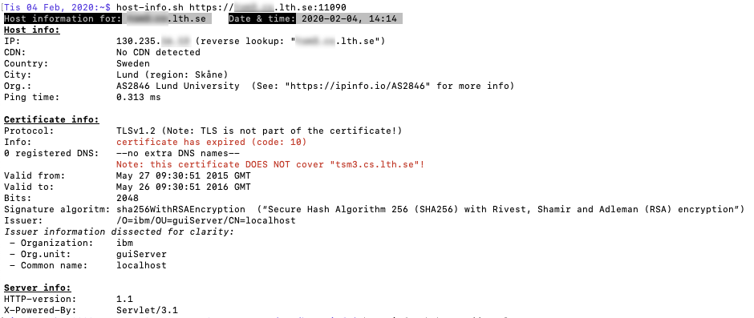
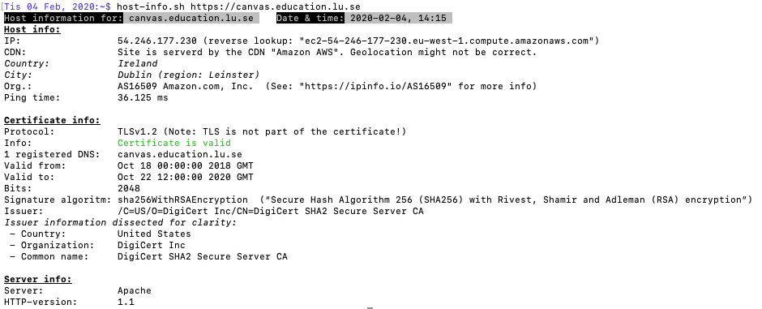

# host-info.sh

## About the script

A bash-script to get various info about a given machine on the internet:

* Geographic location of the device (country and city)
* IP-address and reverse lookup (i.e. the DNS name that the IP address represents)
* Registrar for the device
* Ping time for the host (lower is better)

The geographic information is retrieved from `ipinfo.io`.

If the device is given with a `http` or `https` address, the following is reported:

* Certificate info:  
	* If it's valid or not
	* What DNS-names the certificate covers
	* Valid dates (from- and to)
	* What version of TLS (Transport Layer Security) is used
	* Who has issued the certificate
* Server info (not all servers use all fields):
	* HTTP-version
	* What sever (`apache`, `nginx`etc.)
	* “Via”, i.e. if a cache has been used
	* “X-Generator”, i.e. CMS or such, for example “Drupal”
	* “X-Powered-By”, i.e. `PHP` or specialized servers

The certificate information is retrieved using [openssl](https://www.openssl.org/docs/man1.0.2/man1/) and the server info comes from the [HTTP header](https://en.wikipedia.org/wiki/List_of_HTTP_header_fields) and is retrieved with [curl --head](https://curl.haxx.se/docs/manpage.html).

##Requirements
You must have `curl` and `dig` on your system.  
In order for the certificate check to work, you must have a fairly modern version of `openssl`. This excludes OS X / macOS up until version 10.12.

## Usage

You will get the most out of it with a URL. Simply copy it from a web browser and paste in the terminal!  
You may however also enter just a DNS-name or an IP-address.

1. URL: `host-info.sh https://dns.name:port/path`
2. DNS-name: `host-info.sh dns.name`
3. IP-address: `host-info.sh ip.number.xx.yy`

-----

## Screen shots:

  

  

  
